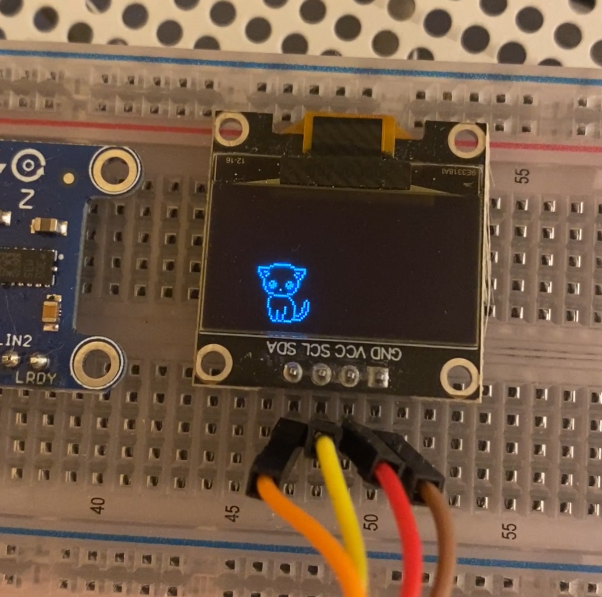

# Intro

This shows the silly cat simulator running on an STM32 using a
small OLED display.

It uses the libmewo silly cat simulator and libaprilstm23.



# Instructions

Generate the project using STM32CubeMX
- Select STM32F411CEU6 MCU
- Set pin PC13 to GPIO_Output
- Enable USART1_RX (PA10) and USART1_TX (PA9)
- Enable the RCC HSE and LSE crystal clocks
- Enable I2C1 (SDA on PB7, SCL on PB6)
- Set toolchain to Makefile

Install the following archlinux packages...
- `arm-none-eabi-gcc`
- `arm-none-eabi-newlib`
- `arm-none-eabi-gdb`
- `openocd`
- `stlink`


Flash board:
```sh
sudo st-flash write mewo_stm32.bin 0x08000000
```

Reset board
```sh
sudo st-flash reset
```


Start OpenOCD:
```sh
openocd -f interface/stlink-v2.cfg -f target/stm32f4x.cfg
```


Connect to serial device:
```sh
sudo screen /dev/ttyACM0 115200
sudo picocom -b 115200 /dev/ttyACM0 
```


Reset STM32
```sh
openocd -f interface/stlink-v2.cfg -f target/stm32f4x.cfg -c "init" -c "halt" -c "stm32f4x unlock 0" -c "reset halt" -c "exit"
```

